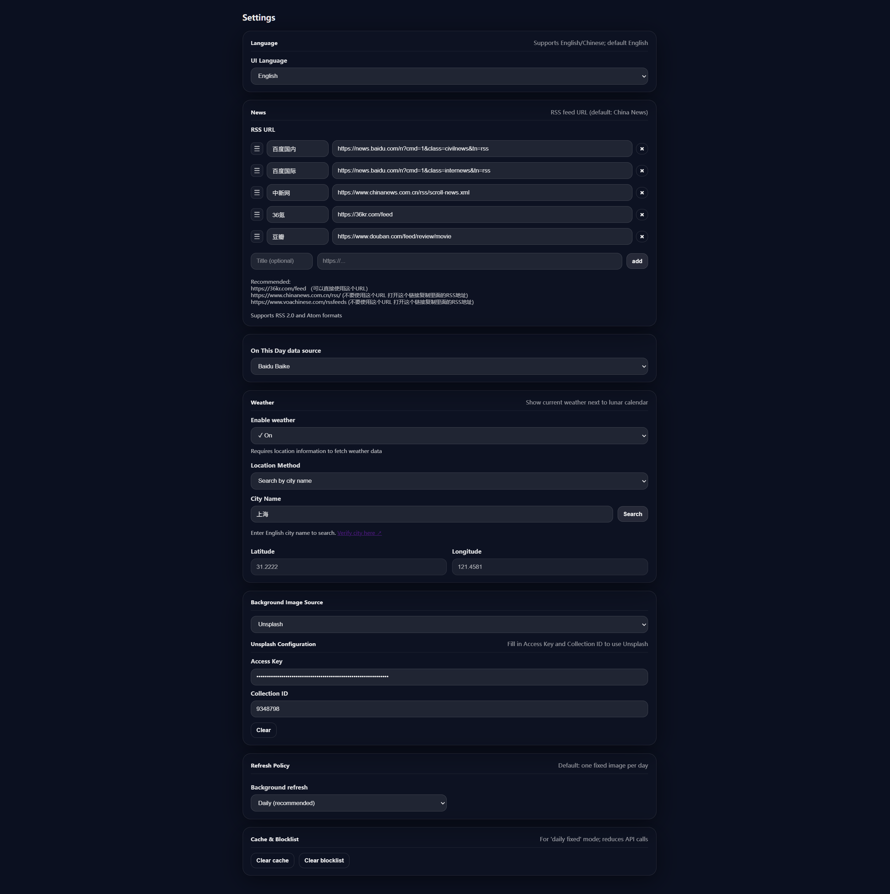

# 看尽
中文名：看尽
英文名: Glance
一个智能新标签页扩展：**日历/农历 + 天气 + 新闻 + 历史上的今天 + 精美壁纸**





# 📦 安装方法

1. 打开 Chrome：`chrome://extensions`
2. 右上开启"开发者模式"
3. 点击"加载已解压的扩展程序"，选择本目录（包含 `manifest.json`）
4. 打开一个新标签页验证

# ✨ 功能介绍

## 📅 日历与农历

- **公历**：年月日 + 星期
- **农历**：月份 + 日期 + 生肖年（如：蛇年、虎年）
- 支持中英文界面切换

## 🌤️ 天气信息

- **显示内容**：
  - 当前天气：图标 + 温度 + 降水（如有）
  - 空气质量：AQI 值 + 等级图标（🟢优 / 🟡良 / 🟠轻度污染 / 🔴中度污染 / 🟣重度污染 / ⚫严重污染）
  - 明天预报：图标 + 最低~最高温度
- **位置获取方式**（二选一）：
  1. **自动获取**：使用浏览器地理位置 API（需要授权）
  2. **手动输入城市**：输入英文城市名（如：Shanghai, New York），自动搜索并获取经纬度。优先选择手填，防止定位不准
- **数据来源**：
  - 天气数据：Open-Meteo Forecast API
  - 空气质量：Open-Meteo Air Quality API
- **缓存策略**：天气和空气质量数据缓存 1 小时，减少 API 请求

## 📰 新闻

- 支持 RSS 订阅
- **RSS源示例**：
  - 中新网：`https://www.chinanews.com.cn/rss/scroll-news.xml`
  - VOA 英文：<https://www.voanews.com/rssfeeds> 里选择 "Subscribe" 地址
  - VOA 中文：<https://www.voachinese.com/rssfeeds> 里选择 "订阅" 地址
- 显示新闻发布日期（精确到秒）

## 📜 历史上的今天

- **数据源可选**：
  - **百度百科**（默认，中文，30 字符限制）
  - **Wikipedia**（可选语言：zh / en / ja / fr ...，60 字符限制）
- 显示 3 条历史事件，按年份倒序排列
- 支持点击跳转到详情页面

## 🖼️ 背景图

- **四种来源可选**：
  1. **本地图片**：使用 `img/` 文件夹中的图片（可以自己添加图片后 需运行 `generate_manifest.py` 生成清单）
  2. **本地上传图片**：拖拽上传图片到浏览器 IndexedDB（支持导入/导出备份）
  3. **Bing 每日壁纸**（默认，免 Key，自动启用）
  4. **Unsplash**（可选配置，需填写 Access Key + Collection ID, Unsplash文档: https://unsplash.com/developers）
- **刷新策略**：每天固定一张 / 每次打开随机
- **图片管理**：
  - 右下角显示图片来源
  - 右键图片署名可屏蔽当前图片并自动换一张
  - 上传的图片支持导出为 JSON 备份，支持从备份导入

# ⚙️ 设置页介绍

- **新闻配置**：RSS 订阅地址
- **语言设置**：
  - 界面语言（English / 中文）
  - 历史上的今天数据源（百度百科 / Wikipedia）
  - Wikipedia 语言代码（仅在选择 Wikipedia 时显示）
- **天气配置**：
  - 启用/禁用天气（默认关闭）
  - 获取位置方式：
    - **自动获取**：点击按钮，浏览器会请求地理位置授权
    - **手动输入城市**：输入英文城市名，点击"搜索"，从结果中选择城市自动填充经纬度
  - 可验证城市：<https://open-meteo.com/en/docs/geocoding-api>
- **背景图配置**：
  - 背景图片来源（本地图片 / 本地上传图片 / Bing 随机壁纸 / Bing 今日壁纸 / Unsplash）
  - Unsplash Access Key / Collection ID（仅在选择 Unsplash 时显示）
  - 背景刷新策略
  - 上传图片区域（仅在选择"本地上传图片"时显示）
  - 图片导入/导出功能
- **缓存管理**：清空缓存（包括天气缓存）/ 屏蔽列表

# 关于本地图片/上传图片

## 如果想批量导入图片到本地图片作为背景 (合适大量图片)

1. 将图片放入 `img/` 文件夹（支持子文件夹）
2. 运行脚本生成清单：

   ```bash
   python generate_manifest.py
   ```

3. 在设置页选择"本地图片"作为背景来源

## 上传图片作为背景

1. 在设置页选择"本地上传图片"
2. 拖拽图片到上传区域，或点击选择文件
3. 图片会自动保存到浏览器 IndexedDB
4. （可选）点击"导出图片"备份，或"导入图片"恢复

# 💡 小技巧

- **右下角图片署名（credit）右键**：屏蔽当前图片并自动换一张
- **鼠标悬停新闻/历史卡片**：去除模糊，方便阅读
- **天气信息悬停**：显示详细天气信息（天气描述、AQI 等级、明天预报）
- **自动保存**：所有设置修改后自动保存，顶部会显示"已保存"提示
- **图片备份**：定期导出上传的图片，避免浏览器数据清除后丢失
- **天气缓存**：天气数据缓存 1 小时，如需立即更新可清空缓存